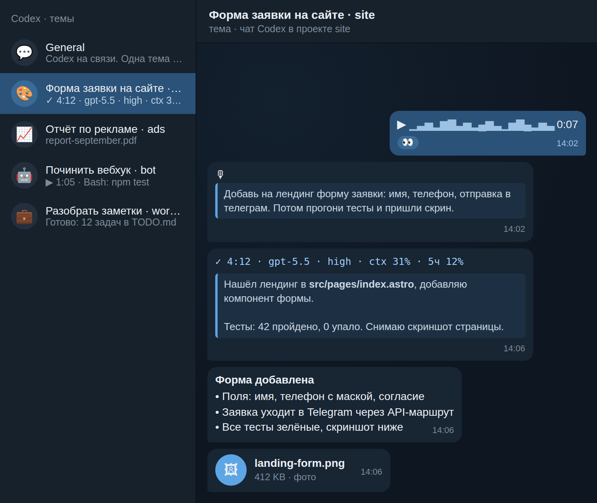
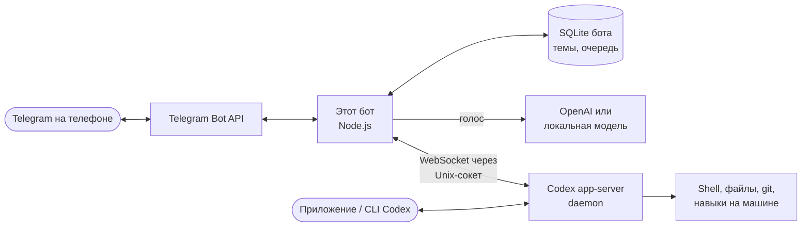

<div align="center">

# 🤖 Codex Telegram Bot

### Твой Codex в Telegram: проекты, чаты, голосовые и файлы — с телефона

**Пишешь или наговариваешь задачу в Telegram, Codex выполняет её у тебя на сервере или компьютере, и в ту же тему приходят ход работы, ответ и готовые файлы.**


[](https://github.com/artemmarketolog/codex-telegram-bot/actions/workflows/ci.yml)


<br>



</div>

---

> 🧑‍🎓 **Не хочешь ставить руками?** Отправь своему ИИ-агенту (Codex, Claude Code, Cursor) ссылку на этот репозиторий и напиши: **«Установи мне этого бота по INSTALL.md»**. Агент всё поставит и проверит сам, а тебя позовёт только за токеном бота и парой нажатий в Telegram.

## Что это

Telegram-интерфейс к [OpenAI Codex](https://developers.openai.com/codex). Бот подключается к Codex на твоей машине (VPS или компьютер) и превращает личный чат с ботом в рабочее место:

- **одна тема Telegram = один чат Codex**, в общем чате лежат меню и новые задачи;
- чаты сгруппированы **по проектам** (папкам), как в боковой панели приложения Codex;
- это **те же самые чаты**, что в приложении и CLI: начал на компьютере — продолжил с телефона, и наоборот;
- работа идёт на машине, где стоит Codex, поэтому на VPS она не прерывается, даже если телефон и ноутбук выключены.

## ✨ Возможности

- 💬 **Темы вместо хаоса.** Каждая задача живёт в своей теме с названием «задача · проект» и иконкой проекта.
- 🎙 **Голосовые.** Наговариваешь задачу, бот расшифровывает её (OpenAI или бесплатная локальная модель) и отдаёт Codex. Расшифровка видна свёрнутой цитатой.
- 📎 **Файлы в обе стороны, до 2 ГБ.** Фото, документы, архивы, видео уходят Codex оригиналами (большие файлы — через свой Local Bot API, ставится одним скриптом). Файлы, которые сделал Codex, приходят в тему: картинки превью, видео плеером, остальное документом.
- 📊 **Живая карточка хода.** Время, модель, заполненность контекста, текущее действие (`Bash: npm test · 0:37`), субагенты, фоновые задачи, лимиты и кнопка **■ Стоп**. После хода карточка сворачивается в одну строку.
- ✍️ **Уточнения на лету.** Сообщение во время работы уточняет текущий ход, а не ждёт очереди. `/queue` ставит отдельную задачу в очередь.
- 🧠 **Модель и глубина мышления** для каждого чата или по умолчанию (`/model`), плюс `/context`, `/compact`, `/files`, `/archive`.
- 🖥 **Чаты с компьютера** сами получают тему в Telegram в течение минуты.
- 🔒 **Только владелец.** Бот отвечает одному Telegram ID в личном чате, остальных молча игнорирует.

## 🏗 Как это устроено



Бот не хранит свою копию переписки: он подключается к общему [`codex app-server daemon`](docs/ARCHITECTURE.md) и работает с настоящими чатами Codex, как ещё один клиент. Поэтому история, память и инструменты одни и те же в Telegram, в приложении и в CLI.

<details>
<summary>🧩 Простыми словами</summary>

<br>

| Слово | Что это | Аналогия |
| --- | --- | --- |
| **Codex daemon** | Фоновый процесс Codex на машине | Офис, где работает сотрудник |
| **Бот** | Мост между Telegram и Codex | Секретарь, который передаёт записки и отчёты |
| **Тема** | Отдельная ветка внутри чата с ботом | Папка для одного дела |
| **Threaded Mode** | Настройка бота в BotFather, которая включает темы | Разрешение завести папки |
| **VPS** | Арендованный сервер в интернете | Офис, который не закрывается на ночь |

</details>

## 🚀 Установка

**Проще всего через агента:** открой [INSTALL.md](INSTALL.md), там готовый промпт и пошаговый урок. Агент сам проверит окружение, поставит зависимости, запустит самопроверку и настроит автозапуск.

Руками — пять команд, если Codex и Node.js 22.13+ уже стоят:

```bash
git clone https://github.com/artemmarketolog/codex-telegram-bot.git
cd codex-telegram-bot
npm install
cp .env.example .env              # впиши токен бота и свой Telegram ID
npm run doctor -- --start-daemon  # самопроверка: всё должно быть ✅
bash scripts/install-service.sh   # автозапуск (systemd на Linux, launchd на macOS)
```

Файлы больше 20 МБ: впиши в `.env` ключи с [my.telegram.org](https://my.telegram.org) и запусти `bash scripts/install-local-bot-api.sh` — бот начнёт принимать и отправлять файлы до 2000 МБ ([docs/LOCAL-BOT-API.md](docs/LOCAL-BOT-API.md)).

Перед этим в [@BotFather](https://t.me/BotFather) нужно создать бота и **включить темы в мини-приложении BotFather** (кнопка **Open** → My bots → бот → Bot Settings → Threads Settings → **Threaded Mode**). Командами в чате BotFather темы не включаются. Подробно с картинкой пути — в [INSTALL.md](INSTALL.md#шаг-2-включи-темы-threaded-mode).

## 🎙 Голосовые: два варианта

| | Как | Цена | Качество и скорость |
| --- | --- | --- | --- |
| **OpenAI** (рекомендуется) | `OPENAI_API_KEY` в `.env`, модель `gpt-4o-transcribe` | $5 на балансе хватит на ~13 часов голосовых | Лучшее качество, несколько секунд на сообщение |
| **Локально, бесплатно** | `bash scripts/install-local-stt.sh` ставит NVIDIA Parakeet v3 через whisper.cpp | 0 ₽, работает без интернета | Русский и английский; зависит от процессора |

Как получить ключ и пополнить баланс, а также чем отличаются локальные модели — в [docs/VOICE.md](docs/VOICE.md). Без обоих вариантов бот тоже работает: текст и файлы проходят, а голосовое сохраняется оригиналом с пометкой, что расшифровка не настроена.

## 📱 Команды

| Где | Команда | Что делает |
| --- | --- | --- |
| Общий чат | просто текст / голос / файл | Открывает новую тему в проекте по умолчанию и начинает работу |
| Общий чат | `/start`, `/chats`, `/new` | Меню, последние чаты, новый чат в выбранном проекте |
| Общий чат | `/model` | Модель и глубина по умолчанию для новых чатов |
| Тема | текст / голос / файл | Новый ход или уточнение идущего |
| Тема | `/stop`, кнопка **■ Стоп** | Остановить ход (и поставить очередь на паузу) |
| Тема | `/queue текст` | Добавить отдельную задачу в очередь этого чата |
| Тема | `/model`, `/context`, `/compact` | Модель чата, заполненность контекста, сжатие |
| Тема | `/files`, `/archive` | Файлы чата, архивировать чат (история останется в Codex) |

Кнопка «сменить проект» под первым сообщением темы переносит задачу в другой проект.

## 🔒 Безопасность

- Бот выполняет задачи **с полными правами твоего пользователя** на машине (как Codex в режиме full access). Поэтому доступ строго у одного `TELEGRAM_OWNER_ID` и только в личном чате. Проверка владельца стоит до любого скачивания или вызова Codex.
- Секреты лежат только в `.env` (права `600`, в `.gitignore`). Токены и ключи вырезаются из логов и сообщений; бот не отправляет в Telegram `.env`, `auth.json`, SSH-ключи и файлы, в которых встречаются известные ему секреты.
- Входящие файлы сохраняются в `~/.codex-telegram/files` с безопасными именами. Для Codex это недоверенные данные.
- Защити свой Telegram-аккаунт двухэтапной проверкой: кто владеет аккаунтом, тот управляет машиной.

Подробнее и как сообщить об уязвимости — в [SECURITY.md](SECURITY.md).

## ⚙️ Где что лежит

| Путь | Что |
| --- | --- |
| `.env` | Токен, твой ID, ключ OpenAI или путь к локальной модели |
| `projects.json` | Необязательный список избранных проектов (пример: `projects.example.json`) |
| `~/.codex-telegram/` | База бота и полученные файлы (`CODEX_TELEGRAM_DATA`) |
| `~/.codex/` | Сам Codex: вход, история чатов, daemon |

Остальные настройки описаны в [.env.example](.env.example). Устройство бота — в [docs/ARCHITECTURE.md](docs/ARCHITECTURE.md), типичные проблемы — в [docs/TROUBLESHOOTING.md](docs/TROUBLESHOOTING.md).

## 📏 Ограничения

- Без своего сервера Telegram бот получает файлы **до 20 МБ** и отправляет **до 50 МБ**. Установка включает [Local Bot API](docs/LOCAL-BOT-API.md) (один скрипт): с ним — до 2000 МБ в обе стороны.
- Инструменты, которые есть только в приложении Codex на компьютере (Computer Use, виджеты), из Telegram недоступны. Всё, что делается через терминал и файлы, работает.
- Если бот стоит на Mac, Mac должен быть включён и не спать. Чтобы работало круглосуточно, ставь на VPS.

## 🧪 Проверено

- `npm test`: 120 автоматических тестов с имитацией Codex и Telegram, включая нагрузочный на восемь чатов сразу. Гоняются в CI на каждый коммит.
- Чистая установка на Ubuntu 24.04 с Node.js 22 и Codex CLI из npm по этой инструкции: `doctor`, запуск, задача с созданием файла, файл пришёл документом, голосовое через OpenAI, `/context`, подсказка при выключенном Threaded Mode.

## 📄 Лицензия

[MIT](LICENSE). Это личный open-source проект, а не официальный продукт OpenAI или Telegram.
