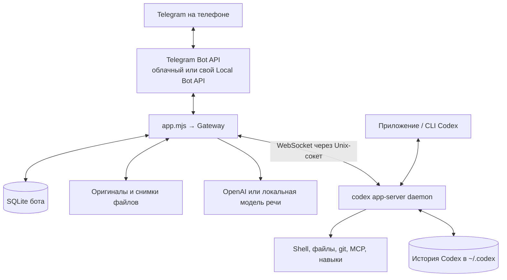

# 🏗 Как устроен бот

Бот — дополнительный клиент Codex, такой же, как приложение или CLI. Он не копирует переписку в свою базу: Telegram и приложение открывают одни и те же чаты Codex по `threadId`. Node.js 22.13+, ESM без сборки, одна зависимость (`ws`).

**Один чат Codex = одна тема** личного чата с ботом (темы в личных чатах, Bot API 9.3+). Общий чат (General) — лобби. Списки повторяют боковую панель Codex: «Чаты» → «Проекты» → проект → чаты. В протоколе чат называется `thread`, один запуск агента — `turn`.

## Компоненты

| Файл | Ответственность |
| --- | --- |
| [`app.mjs`](../app.mjs) | Конфигурация из `.env`, сборка зависимостей, polling, корректное завершение |
| [`lib/gateway.mjs`](../lib/gateway.mjs) | Маршрутизация, темы, меню, события Codex, очередь, карточки, восстановление после рестарта |
| [`lib/codex.mjs`](../lib/codex.mjs) | JSON-RPC поверх WebSocket к сокету daemon |
| [`lib/telegram.mjs`](../lib/telegram.mjs) | Bot API: отправка, форматирование, скачивание, лимиты частоты |
| [`lib/media.mjs`](../lib/media.mjs) | Сохранение вложений, manifest, расшифровка речи (OpenAI / whisper.cpp) |
| [`lib/state.mjs`](../lib/state.mjs) | SQLite бота и проверка владельца |
| [`lib/projects.mjs`](../lib/projects.mjs) | Проекты, названия, иконки тем, заполненность контекста |
| [`lib/card.mjs`](../lib/card.mjs) | Отрисовка карточки хода (чистая функция) |
| [`scripts/ensure-codex-daemon.mjs`](../scripts/ensure-codex-daemon.mjs) | Запускает daemon, только если его нет; работающий не трогает |
| [`scripts/doctor.mjs`](../scripts/doctor.mjs) | Самопроверка установки |

## Связь с Codex

Сокет: `~/.codex/app-server-control/app-server-control.sock` (или `$CODEX_HOME/...`). Это **WebSocket поверх Unix-сокета**, каждое сообщение — один JSON-RPC объект. Подключение: `initialize` с `capabilities.experimentalApi: true`, затем `initialized`.

Используемые методы: `model/list`, `thread/list`, `thread/start`, `thread/resume`, `thread/unsubscribe`, `thread/archive`, `thread/unarchive`, `thread/name/set`, `thread/turns/list`, `thread/read`, `thread/compact/start`, `thread/backgroundTerminals/list`, `turn/start`, `turn/steer`, `turn/interrupt`, `account/rateLimits/read`.

Ходы из Telegram запускаются с `approvalPolicy: never` и `sandboxPolicy: dangerFullAccess`: агент работает с правами пользователя, под которым запущен бот. Каждый `turn/start` несёт `additionalContext.telegram`: «этот чат и есть Telegram, файлы отдавай абсолютными ссылками».

Timeout запроса не доказывает, что операция не выполнена, поэтому мутации (`turn/start` и другие) автоматически не повторяются.

## Приём сообщений и две разные очереди

1. `getUpdates` получает update; **проверка владельца** (`from.id` и личный чат `TELEGRAM_OWNER_ID`) выполняется до скачивания файлов и вызова Codex.
2. Адрес — тема сообщения: её чат Codex либо `topic:N`, если чат ещё не создан. Сообщение в General открывает новую тему в проекте по умолчанию (сообщения альбома или отправленные в пределах 30 секунд — в одну тему).
3. Update сохраняется в SQLite по уникальному `update_id`, только потом бот подтверждает offset. Повтор update от Telegram не выполнится дважды.
4. Команды и кнопки выполняются рядом с polling, обычные сообщения — отдельным последовательным обработчиком на каждую тему. Загрузка файла в одной теме не задерживает другие.

**Транспортная очередь** (`updates`) — для надёжного приёма. **Очередь задач** (`turn_queue`) создаётся только явным `/queue текст`: такие задачи запускаются по одной после окончания текущего хода. Обычное сообщение во время хода уходит в `turn/steer` и уточняет текущую работу.

## Карточка хода и доставка

Одна живая карточка на ход, правится примерно раз в 8 секунд: время, модель, глубина, заполненность контекста (`last.inputTokens / modelContextWindow`), текущее действие с его временем, журнал комментариев агента, субагенты, фоновые задачи, лимиты, кнопка **■ Стоп**. После хода — одна строка (`✓ 6:48 · модель · effort · ctx 38%`) и журнал свёрнутой цитатой. `💻` — ход начат с компьютера, `⤷` — Codex продолжил сам (например, после фонового субагента).

Финальный ответ идёт через `sendRichMessage`, при ошибке формата — обычным HTML, затем простым текстом. Абсолютные Markdown-ссылки на локальные файлы в ответе становятся вложениями: файл сначала копируется в `~/.codex-telegram/files/<чат>/outputs`, отправляется копия (фото, видео, аудио или документ). Файлы секретов (`.env`, `auth.json`, SSH-ключи) и файлы, содержащие известные боту секреты, не отправляются.

## Голос и файлы

Вложение скачивается в `~/.codex-telegram/files/<чат>/` под сгенерированным именем, рядом — manifest с метаданными. Изображения JPEG/PNG/WebP Codex получает как картинки, остальные файлы — как абсолютные пути. Голос и аудио проходят `ffmpeg` и уходят в OpenAI (`gpt-4o-transcribe`, куски по 3 минуты) или в локальную модель whisper.cpp (Parakeet или Whisper, WAV 16 кГц). Ошибка расшифровки не теряет оригинал.

## Память и нагрузка

Каждый загруженный в daemon чат держит процессы. Бот отписывается от чата после 30 минут без активности и подписывается снова при следующем сообщении; после рестарта возобновляет только чаты с незавершённой работой. Нагрузочный тест гоняет восемь чатов одновременно со случайными уточнениями, `/queue`, `/stop` и задержками (`LOAD_SEEDS=80 npm test` для долгого прогона).

## Данные

| Где | Что |
| --- | --- |
| `~/.codex-telegram/data/state.sqlite` | Темы, UI-состояние чатов, входящие updates, очередь задач, привязка сообщений, файлы |
| `~/.codex-telegram/files/` | Полученные оригиналы, расшифровки, снимки отправленных файлов |
| `~/.codex/` | История, настройки и вход Codex — принадлежат Codex, бот их не редактирует |

SQLite в режиме WAL, каталоги `0700`, файлы `0600`, процесс работает с `umask 077`. Старые записи чистятся автоматически (`State.prune`).

## Тесты

`npm test` — 120 тестов на `node:test` с имитацией Codex и Telegram: доступ, темы, карточка, маршрутизация, очередь, восстановление, медиа, конкурентность, нагрузка на восемь чатов. Реальный ffmpeg используется в тестах медиа.
